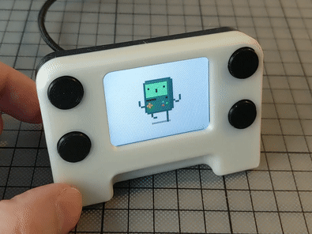

# GIF frame for pimoroni Display HAT Mini
Use pimoroni [Display HAT Mini](https://shop.pimoroni.com/products/display-hat-mini
) as gif images frame.

Button controls:
* A - random image
* B - previous image
* X - switch between gif and logos folders
* Y - next image

# Demo
[](https://www.youtube.com/watch?v=NcS6yQoM3zI&list=PLFmnthuksGmz1-Fse39k7mxbNWnz0EEVF&index=1)
[](https://www.youtube.com/watch?v=z_FbBSWG20c&list=PLFmnthuksGmzZ2E7i2bHiQxSixvhjyHqF&index=1)


# 3d printed case



* on [cults3d](https://cults3d.com/en/users/printminion/creations)
* on [shapeways](https://www.shapeways.com/shops/printminion)
* follow me on Twitter [@printminion](https://twitter.com/printminion)

# Setup
````bash
git clone https://github.com/printminion/pimoroni-Display-HAT-Mini-gif-frame.git
pip3 install -r requirements.txt
````
* add images (preferably 320x240) to folders:
  * `gifs` - put `gif` files here 
  * `stills` - put `png` or `jpg` files here.

You can use sub folders.

* add script to autostart
````bash
sudo nano /etc/rc.local
sudo /home/pi/develop/gif_frame.py
sudo reboot now
````


# Images
* https://dribbble.com/shots/2999006-Octobit-1-BMO

# Links
* online gif resizer https://ezgif.com/